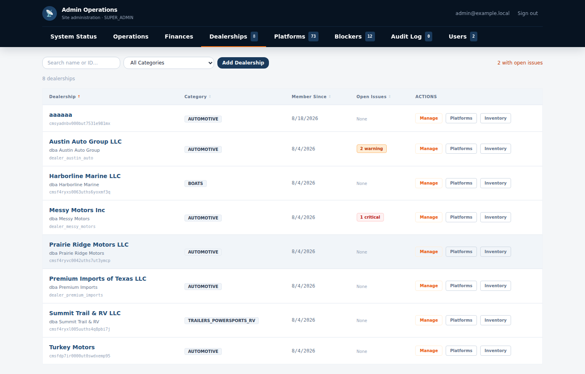
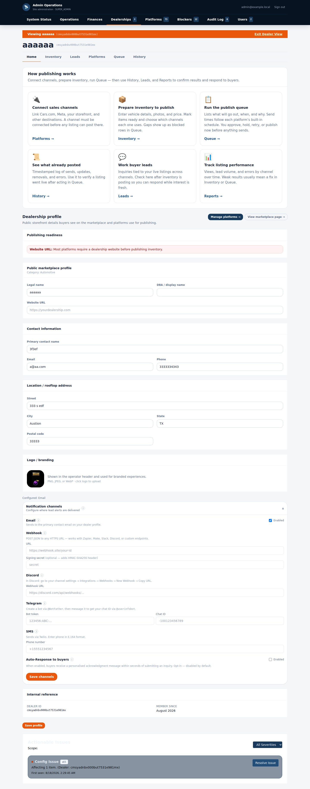
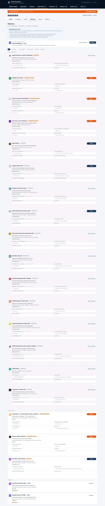
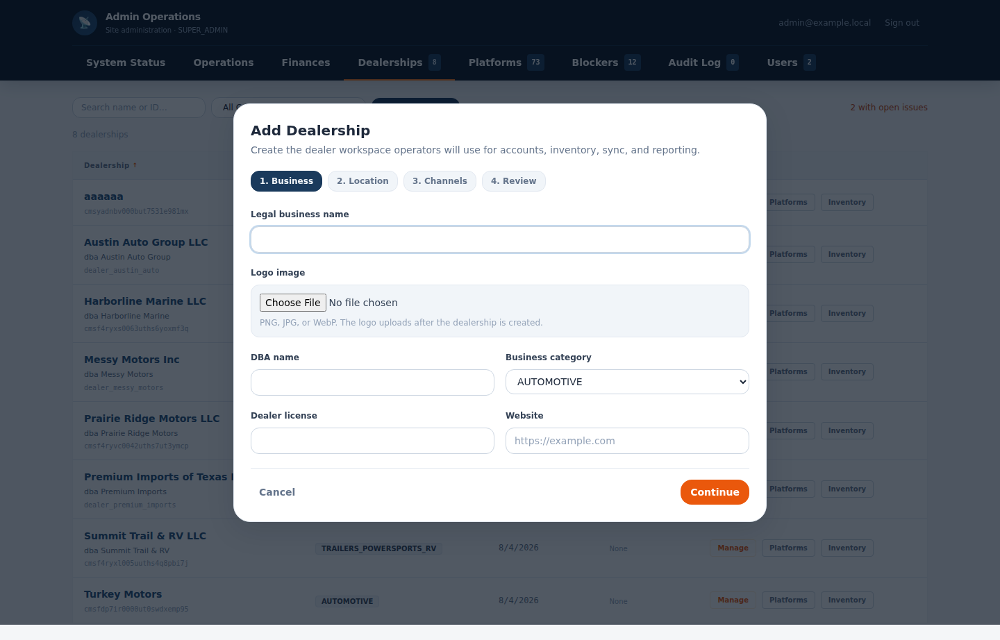

# Admin Dealers Console — UX Complexity & Improvement Proposal

**Surface reviewed:** `http://localhost:5173/#/admin/dealers/` (SUPER_ADMIN "Dealerships" tab and everything reachable underneath it)
**Trigger:** User testing feedback describes confusion, discouragement, and a feeling that "so much functionality is foreign" to casual/occasional users of this screen.
**Method:** Live walkthrough of the running app as a seeded `SUPER_ADMIN` (screenshots below), paired with a source-level audit across four independent review passes — information architecture & navigation, cognitive load & density, terminology & content, and interaction consistency/bugs. Every claim below is backed by a file and line reference so it can be verified and actioned directly.

**Execution decision (post-review):** the correctness/usability fixes below ship independently of the larger domain-driven redesign already in motion for this surface (shared scoped Operations, a dealer workspace scoped to Home/Inventory/Leads/Platforms, Queue/History retirement after workflow parity). Two changes from the original review were superseded by that decision:
- The P1 recommendation to **merge the two stacked tab bars** (§5, former item #7) is **dropped**, not deferred — building it would be effort spent on IA the redesign removes outright once the dealer detail view stops embedding the full operator app. Don't build it as an intermediate step.
- The **dual-save data-loss bug** (former P1 item #12) was **re-classified as P0** — silently dropping a user's edits is a correctness bug, not polish, regardless of which release track it ships on.

Execution order: **P0 bugs/correctness → stabilize shared Operations domain → build Inventory/Platform replacement workflows → simplify Home → prove Queue/History parity → remove old navigation → broader progressive-disclosure polish.**

All P0 items below have shipped (see per-item status in §5).

---

## 1. Executive summary

The admin dealers console is not confusing because any single screen is badly built — the components themselves are competently made. It's confusing because **three unrelated design decisions compound on top of each other**:

1. **Structural** — a dealer detail view is built by dropping the *entire* dealer-operator app (an 8-tab surface meant for a dealer's own staff) inside the *already-8-tab* SUPER_ADMIN shell, with no merging of the two navigation systems. A user tracks two tab bars plus a banner just to know where they are.
2. **Density** — nothing is progressively disclosed. A single "Home" tab renders ~35–40 interactive elements (explainer tiles, a full profile form, five always-expanded notification-channel sections, an issues feed) in one scroll. The Platforms tab renders all 23 partner integrations at once, roughly 60–90 raw fields, with no grouping/collapse.
3. **Vocabulary drift** — the code, the URL, and the on-screen label frequently disagree (a tab reads "Blockers" but is coded `triage` and routes through `blocked-dealers`; "Finances" is coded `insights`). That drift is a signal, not just cosmetic noise: it means the mental model shifted after the UI shipped, and the UI never caught up.

On top of that, the review surfaced a **confirmed navigation bug**: two of the three action buttons on every row of the dealer list eject the SUPER_ADMIN out of the admin shell entirely into a different, differently-skinned view with no way back except through the anonymous dealer picker (§3.1).

None of this requires a rebuild. Section 5 lays out a prioritized, file-level fix list — most of section is small, mechanical changes (flip a default prop, fix two hrefs, add an accordion) rather than new architecture.

---

## 2. Current state — what's actually at `/admin/dealers/`

### 2.1 Outer shell: 8 top-level admin tabs

`apps/web/src/pages/AdminApp.tsx:154-163` renders one tab bar with 8 destinations:

| Tab label | Internal id | URL |
|---|---|---|
| System Status | `system` | `#/admin` |
| Operations | `operations` | `#/admin/operations` |
| Finances | `insights` | `#/admin/insights` |
| Dealerships | `dealers` | `#/admin/dealers` |
| Platforms | `platforms` | `#/admin/platforms` |
| Blockers | `triage` | `#/admin/triage` (also reachable via `blocked-dealers`) |
| Audit Log | `audit` | `#/admin/audit` |
| Users | `users` | `#/admin/users` |

Note already: 3 of 8 tabs have an internal id that doesn't match the label a user reads (`insights`→"Finances", `triage`→"Blockers", plus a second URL alias for the same tab). See §4.3.

### 2.2 Dealer list ("Dealerships" tab)

`apps/web/src/features/adminOverview/tabs/dealerships/DealershipsTab.tsx` — a searchable, sortable, filterable table of every dealer, each row offering three actions: **Manage**, **Platforms**, **Inventory**.

### 2.3 Drilling into one dealer

Clicking **Manage** opens `AdminDealerPage.tsx`, which renders the *entire* dealer-operator application inside the admin shell (`apps/web/src/pages/AdminApp.tsx:231-273`): Home, Inventory, Leads, Platforms, Queue, History, Reports, Help — the same nav (`apps/web/src/lib/operatorNav.ts`) a dealership's own staff use day-to-day. This produces a second, independently-styled tab bar (`apps/web/src/components/operator/PageShell.tsx:94-109`) stacked directly under the outer admin tab bar, plus a third navigational affordance — an orange "Viewing {dealer} / Exit Dealer View" banner (`AdminApp.tsx:199-208`).

The dealer's "Home" tab alone stacks four unrelated modules in one uninterrupted scroll (`AdminDealerPage.tsx:74-78`):
- A static 6-tile "How publishing works" explainer (`PublishingFlowComic`)
- A full dealership profile form: readiness warnings, marketplace profile, contact info, address, logo upload, and **five fully-expanded** notification-channel configs (Email/Webhook/Discord/Telegram/SMS/Auto-response)
- An activity/issues feed with its own severity filter

### 2.4 Platforms tab (per dealer)

All 23 partner integrations (Facebook, Google, Meta, TikTok, CarGurus, Cars.com, Autotrader, CARFAX, SFTP feeds, etc.) render simultaneously with no pagination, grouping-collapse, or search — each card carrying 2–4 raw credential/ID fields.

### 2.5 Creating a dealer

`DealershipIntakeFlow.tsx` — a well-scoped 4-step wizard (Business → Location → Channels → Review), structurally the *best-behaved* flow in this surface.

---

## 3. Why users report confusion — root cause analysis

### 3.1 Confirmed bug: two of three row actions silently swap the entire app shell

`DealershipsTab.tsx:200-202` — the **Manage** link correctly points at `adminDealerHash(dealer.id)` (`#/admin/dealers/{id}`), which mounts inside `AdminApp`. But **Platforms** and **Inventory** are hardcoded to `#/${dealer.id}/platforms` and `#/${dealer.id}/inventory` — a completely different, non-admin route namespace.

Traced end-to-end: that URL shape sets `route.dealerId` with `adminDealerId = null`, which makes `superAdminHome` false (`apps/web/src/App.tsx:59`) and bypasses `AdminApp` entirely (`App.tsx:96-123`). The user lands in the plain operator app: `PageShell.tsx`'s non-admin branch (lines 115–183) — full navy header, "Sign out," and "← Change Dealer" (which goes to the anonymous dealer picker, not back to `#/admin/dealers`). **Two of three buttons on every row quietly remove the admin chrome and the only way back.** This isn't a permission error (SUPER_ADMIN has access either way) — it's a silent, successful navigation into the wrong app skin.

**Fix:** point both hrefs at `` `${adminDealerHash(dealer.id)}/platforms` `` / `` `.../inventory` `` (one-line change, `DealershipsTab.tsx:201-202`).

### 3.2 Two full navigation systems stacked with no merge

Counting distinct chrome/menu layers between the dealer list and, say, a platform credential field: outer 8-tab admin bar → "Viewing X" banner → inner 6-tab operator bar (which itself hides 2 of the 8 real `OperatorTab` values — Reports and Help have working routes but no visible tab, `operatorNav.ts:39-46` vs `PageShell.tsx:95`) → platform list → platform detail → platform-scoped queue/history (a *different* Queue/History than the dealer-level one reachable from the inner tab bar, despite sharing the same label). **Six layers**, two of which aren't even tabs, one of which duplicates a label three levels apart with different meaning each time (Dealerships → Manage → Home).

There's also outright redundancy: the "Manage platforms →" button on the profile panel (`DealershipProfilePanel.tsx:193-194`) sits next to a "Platforms" tab in the same tab bar it duplicates.

### 3.3 Nothing is progressively disclosed — the real driver of "too much at once"

This is quantifiable, not just a vibe:

- `DealershipProfilePanel.tsx:307` passes `defaultOpen` to `NotificationChannelsPanel`, overriding that component's own sane default of `false` (`NotificationChannelsPanel.tsx:71`). Five channel sections (~10 fields, two of them secrets) render open on a page that's already long, even though a one-line summary already exists two lines above (`:306`).
- `PublishingFlowComic.tsx` has **no dismissal mechanism at all** — no `localStorage`, no "don't show again," not even a collapse toggle. A daily admin scrolls past the same 6-tile explainer on every single dealer visit, forever.
- `PlatformChannelList.tsx:431-442` maps all groups/rows with no `.slice()`, no accordion, no "show more" — all 23 platforms render fully expanded every time.
- Net result on the Home tab alone: **~35–40 distinct interactive elements visible before the user has done anything.** The Platforms tab: **~60–90 raw input fields on one screen.**

### 3.4 Vocabulary drift between code, URL, and label

Confirmed pattern, not a one-off: the "Blockers" tab is internally `triage`, routes through the URL segment `blocked-dealers`, and is referred to as "system blockers" in the publishing-flow explainer copy and "Triage" elsewhere — **four names for one concept.** The "Finances" tab is internally `insights`. `platformRepEmail` is labeled "Rep Email," "Manager Email," or "Contact Email" depending on which of 23 platform entries you're looking at (`src/data/platformProfiles.ts`). This kind of drift means whoever names things in the UI and whoever built the data model stopped talking to each other at some point — and it reliably resurfaces as user confusion, because support docs, URLs, and error messages will keep leaking the "wrong" name.

Deeply technical fields are also handed to admins with no translation: "Signing secret (optional — adds HMAC-SHA256 header)," "Enter phone in E.164 format," "Create a bot via `@BotFather`... get your chat ID via `@userinfobot`" (`NotificationChannelsPanel.tsx:164,202-203,235`). These assume backend/API familiarity a casual ops user won't have.

### 3.5 Inconsistent interaction patterns force users to relearn the UI mid-task

- **Two independent "Save" buttons, no shared dirty state.** "Save profile" (`DealershipProfilePanel.tsx:326-328`) only persists legal name/contact/address — it never touches the notification-channel form rendered inline above it, which has its own separate "Save channels" button and local state (`NotificationChannelsPanel.tsx:84-94,340-347`). An admin who edits a contact field and a webhook URL, then clicks the bottom button, **silently loses the webhook edit** with no warning.
- **Invalid nested `<button>`.** The channel-panel accordion header is a `<button>` that itself contains `InfoButton`'s own `<button>` (`NotificationChannelsPanel.tsx:105-118` wrapping `InfoButton.tsx:16-24`). This is a real React DOM-nesting warning confirmed live, not a style nit — click behavior near the info icon is undefined across browsers, and screen readers announce or drop the inner control unpredictably.
- **Create vs. edit are two unrelated mental models.** Creating a dealer uses a guided, staged, reviewed wizard (`DealershipIntakeFlow.tsx`). Editing the same dealer's near-identical fields is one long flat scroll with no staging and no review (`DealershipProfilePanel.tsx`). A user has to relearn the interface the moment they go from creating to editing.
- **Confirmation is inverted relative to blast radius.** Suspending a single user requires a confirmation step (`UsersTab.tsx:575-603`), but toggling a platform off *site-wide for every dealer* fires immediately with no confirmation (`AdminPlatformDetailPage.tsx:745-753`).
- **Mixed navigation primitives for identical affordances.** Dealer rows use real `<a href>` links (`DealershipsTab.tsx:159,200-202` — correct, supports cmd/ctrl-click); the equivalent row-select in `DealerPicker.tsx:136` uses a JS-only `<button onClick>`.
- **Two sequential, differently-shaped loading skeletons** for what reads as one page load: `AdminDealerPage.tsx` blocks on three parallel queries with a 6-row skeleton, then `DealershipProfilePanel` shows its *own* 8-row skeleton once mounted.

---

## 4. High-level improvement themes

These are the five moves that address the root causes above, roughly in priority order:

1. **One navigation system, not two.** Fold the inner 6-tab operator bar into the outer admin shell as a single breadcrumb/segmented sub-nav, rather than stacking a second independently-styled tab bar under the first. Retire the orange banner once the dealer name lives in that one breadcrumb.
2. **Make progressive disclosure the default, not the exception.** Nothing dense should be open by default unless it's the very first thing the user needs. Collapse the notification channels, paginate/group-collapse the platform list, and give the publishing-flow explainer a dismiss/remember state.
3. **Say what the code says.** Reconcile tab id, URL segment, and on-screen label for every admin section so a URL, an API call, and a screenshot all use the same word for the same thing.
4. **One save action per logical entity, with one shared dirty-state.** Users shouldn't have to know that two visually identical buttons on one screen save different things.
5. **Reuse the create-flow's discipline for edit.** The intake wizard's step/validate/review pattern is the best UX in this surface — extend it (or a lighter version of it) to editing, instead of maintaining two mental models for the same entity.

---

## 5. Detailed, prioritized fix list

### P0 — Correctness/usability, shipped independently of the redesign

| # | Fix | File(s) | Status |
|---|---|---|---|
| 1 | Fix the row-action route bug: point "Platforms"/"Inventory" hrefs at the admin namespace | `DealershipsTab.tsx` | ✅ Shipped |
| 2 | Flip `NotificationChannelsPanel`'s `defaultOpen` to conditional (only open when no optional channel is configured yet) | `DealershipProfilePanel.tsx` | ✅ Shipped |
| 3 | Fix invalid nested `<button>` — accordion header is now a `role="button"` div; `InfoButton` click no longer bubbles into the toggle | `NotificationChannelsPanel.tsx`, `InfoButton.tsx` | ✅ Shipped |
| 4 | Remove the redundant "Manage platforms →" button (duplicate of the adjacent Platforms tab); dropped the now-unused `nav` prop from `DealershipProfilePanel` | `DealershipProfilePanel.tsx`, `AdminDealerPage.tsx`, `SettingsPage.tsx` | ✅ Shipped |
| 5 | Gate site-wide platform disable behind a confirmation dialog, matching the pattern already used for user suspension | `AdminPlatformDetailPage.tsx`, pattern from `UsersTab.tsx:575-603` | ✅ Shipped |
| 6 | Give the "Blockers" tab a canonical URL that matches its label (`#/admin/blockers`); old `#/admin/triage` / `blocked-dealers` links still resolve | `AdminApp.tsx`, `PublishingFlowComic.tsx` | ✅ Shipped |
| 7 | **(Elevated from P1)** Fix the dual-save data-loss bug — editing the profile form and the notification-channels panel then clicking either save button no longer silently drops the other's edits | `DealershipProfilePanel.tsx`, `NotificationChannelsPanel.tsx` | ✅ Shipped |

Implementation note on #7: rather than merging the two forms into one (a larger IA change better suited to the later "simplify Home" phase), `NotificationChannelsPanel` now exposes an imperative `{ isDirty, save }` handle. `DealershipProfilePanel`'s "Save profile" flushes pending channel edits when dirty; `NotificationChannelsPanel`'s own save accepts an `onBeforeSave` callback that flushes pending profile edits first. Either button now persists both forms; the two-button layout itself is left for the Home redesign.

### P1 — Structural, needs design pass but no new architecture

| # | Fix | File(s) | Status |
|---|---|---|---|
| ~~7~~ | ~~Merge the two tab bars into one~~ — **dropped**, not deferred. Superseded by the redesign's target IA (dealer workspace = Home/Inventory/Leads/Platforms, outside the admin operator-app embed); building an intermediate merge would be thrown-away work. | `PageShell.tsx:94-109`, `AdminApp.tsx:154-163,231-273` | Superseded |
| 8 | Add the missing Reports/Help tabs to the visible nav, or remove the dead routes if they're not meant to be admin-facing | `operatorNav.ts:39-46` vs `buildAdminDealerNav` in `AdminApp.tsx:61-82` | Open |
| 9 | Split the dealer "Home" tab into sub-sections (Profile / Channels / Issues) instead of one flat stacked scroll | `AdminDealerPage.tsx:74-78` | Open — tracked under "simplify Home" phase |
| 10 | Give the publishing-flow explainer a dismiss/remember state (localStorage-backed collapse) | `PublishingFlowComic.tsx` | Open |
| 11 | Group-collapse the Platforms list (default-collapsed for "not started"/informational groups), cap long groups behind "show more" | `PlatformChannelList.tsx` (group structure at `:86`, render loop `:431-442`) | Open |
| 12 | Extend the intake wizard's staged/reviewed pattern to the edit flow (even a lightweight tabbed version) | `DealershipIntakeFlow.tsx` (pattern to reuse) → `DealershipProfilePanel.tsx` | Open |

> Reminder: "Home should not become the new container for everything removed from navigation." Item #9 exists precisely to prevent that — Home should shrink, not absorb what the tab-bar merge would have hidden there.

### P2 — Content and polish

| # | Fix | File(s) |
|---|---|---|
| 13 | Rewrite technical field help text in plain language (HMAC signing secret, E.164 phone format, Telegram BotFather setup) | `NotificationChannelsPanel.tsx:164,202-203,235` |
| 14 | Standardize `platformRepEmail` label across all platform entries (currently "Rep Email"/"Manager Email"/"Contact Email") | `src/data/platformProfiles.ts` |
| 15 | Distinguish OAuth-connect platforms from manual/SFTP-credential platforms visually in the Platforms grid, not just by reading each card | `PlatformChannelList.tsx`, `platformProfiles.ts` |
| 16 | Consolidate the two sequential/differently-shaped loading skeletons into one page-level loading state | `AdminDealerPage.tsx:36,40-42`, `DealershipProfilePanel.tsx:176-178` |
| 17 | Standardize row-navigation primitive (real `<a href>` vs `onClick` button) across `DealerPicker.tsx` and admin tables | `DealerPicker.tsx:136` vs `DealershipsTab.tsx:159` |

---

## 6. How to tell this worked

Tie the fix list back to the original complaint (confusion, discouragement, "foreign" functionality) with a few measurable checks now that P0 has shipped, and again once P1 lands:

- **Time-to-first-action** on the dealer detail Home tab (still buried under two explainer/form blocks before any actionable item appears — this is a P1 item, not fixed yet).
- **Rage-clicks / dead-clicks** around the notification-channel info icons (should now read ~0 — the nested-button bug is fixed).
- **Support tickets referencing "lost changes"** on the dealer profile (should now read ~0 — either save button persists both forms).
- **Navigation loops back to the dealer picker** from a dealer detail view (was a proxy for users falling out of the admin shell via the P0 #1 route bug — should now read ~0; this was directly instrumentable since it was a specific, known route mismatch).
- A follow-up moderated session with 2–3 internal ops staff repeating the exact task that produced the original complaint (e.g., "onboard a new dealer and connect one platform") — this is the surface most likely to have driven the original feedback, given the intake wizard is the one well-behaved flow and everything downstream of it (Home, Platforms) is where the density and navigation problems concentrate.

---

## Appendix — Review methodology

This document synthesizes four independent, code-grounded review passes plus a live authenticated walkthrough (Playwright, logged in as the seeded `SUPER_ADMIN`) of the exact route in question:

- **Information architecture & navigation** — route/tab structure, the confirmed row-action bug, navigation-layer count.
- **Cognitive load & density** — quantified element counts per screen, progressive-disclosure defaults, non-dismissible static content.
- **Terminology & content** — jargon inventory, id/URL/label mismatches, unexplained technical fields.
- **Interaction consistency & bugs** — the nested-button DOM bug, dual-save-state issue, create/edit pattern mismatch, confirmation asymmetry.

Screenshots in this document were captured directly from the running dev server at `localhost:5173`, not mocked.
